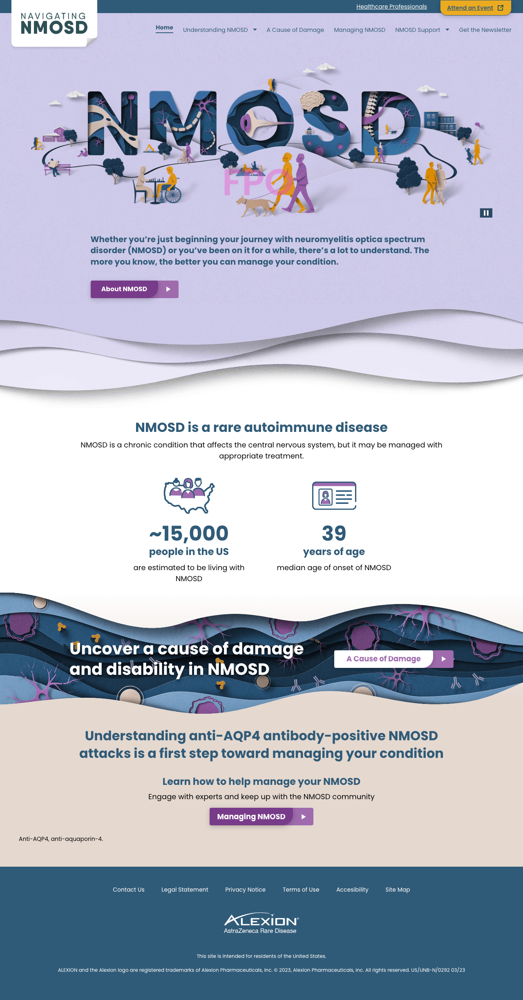

# Patient
NMOSD Patient Site
## Screenshots

### Requirements
1. [Node.js](https://nodejs.org/en/)
2. [Local Web Server](https://github.com/lwsjs/local-web-server)
1. [VS Code](https://code.visualstudio.com/)
2. [Live SASS Compiler Extension](https://marketplace.visualstudio.com/items?itemName=glenn2223.live-sass)

### Installation
1. Clone the repository
2. Install the dependencies
3. Run the local web server
4. Add the following to your vs code settings.json file
```json
"liveSassCompile.settings.formats": [
        {
            "format": "expanded",
            "extensionName": ".css",
            "savePath": "/src/css",
            "savePathReplacementPairs": null
        }
    ],
```
5. Run local web server command
```npm
ws -d src
```
6. Run live sass compiler
7. Open the browser and navigate to http://localhost:8000
8. Enjoy!